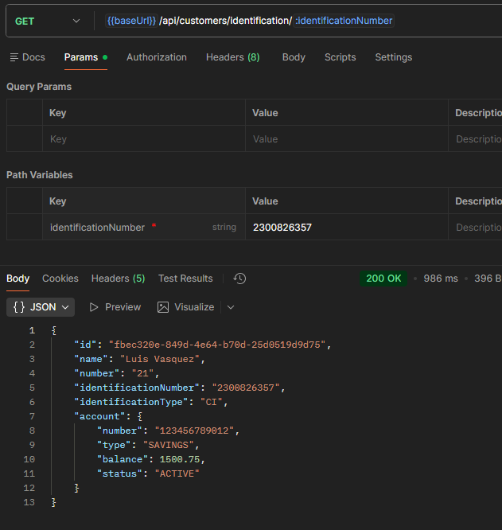
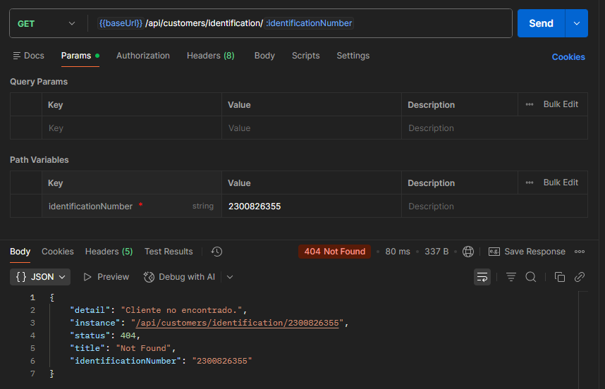
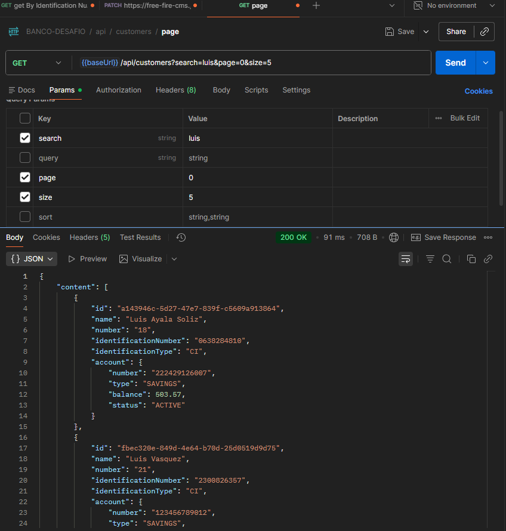
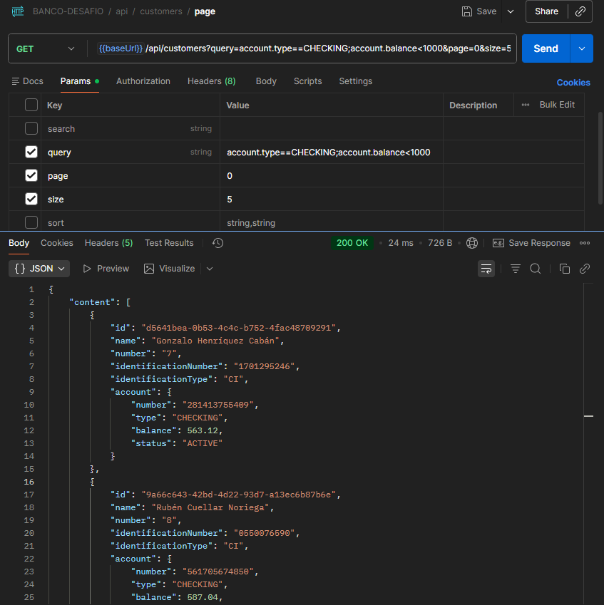
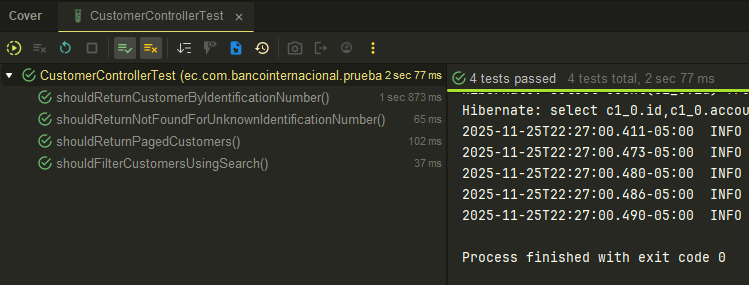
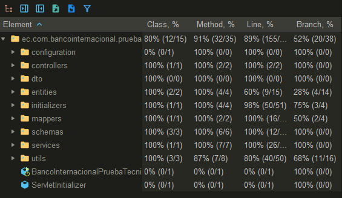

# Banco Internacional - Detalles Técnicos

Este documento describe los detalles técnicos de la aplicación Banco Internacional - Prueba Técnica.

---

## Arquitectura

* La aplicación sigue una **arquitectura de capas**:

    * **Controller / API Layer**: Expone los endpoints REST.
    * **Service Layer**: Contiene la lógica de negocio.
    * **Persistence Layer**: En este proyecto, se usa directamente el **EntityManager**, dado que es un proyecto pequeño y no se creó la capa de repositorios.

* Se usa **Lombok** para generar constructores, builders y getters/setters, agilizando el desarrollo.

---

## Base de Datos

* Se utiliza **PostgreSQL** como base de datos relacional en producción.
* Se utiliza **H2** en modo memoria para las pruebas.
* La configuración de la base de datos está en `application.properties`.
* Se utiliza **Flyway** para gestionar migraciones.
* Las migraciones se encuentran en `classpath:db/migration`.
* Allí mismo se encuentra el script **V1** que contiene el DDL inicial de la base de datos [[V1__init.sql](../applicacion/src/main/resources/db/migration/V1__init.sql)].

---

## Manejo de Errores en API

* Se utiliza la dependencia [`spring-web-problem-details`](https://central.sonatype.com/artifact/com.peluware/spring-web-problem-details) para cumplir con el estándar **[Problem Details RFC 9457](https://www.rfc-editor.org/rfc/rfc9457.html)**.
* Esta dependencia autoconfigura la aplicación spring web para retornar errores de API estandarizados, y ademas proporciona un API fluida para lanzar excepciones que posteriormente serán convertidas en el cuerpo de la respuesta.
* Esta depencia fue desarrollada y publicada por la persona que realizó esta prueba técnica.

```xml

<dependency>
    <groupId>com.peluware</groupId>
    <artifactId>spring-web-problem-details</artifactId>
    <version>1.1.0</version>
</dependency>
```

---

## Búsqueda de Clientes Dinámica (Valor agregado)

* Para el endpoint que retorna clientes de forma dinámica, se utiliza la librería [`omni-search-jpa`](https://github.com/peluware/java-omni-search)
* Esta librería fue desarrollada y publicada por la persona que realizó esta prueba técnica.
* Esta librería es **agnóstica al framework** y permite:

    * Búsquedas textuales y filtradas mediante **RSQL**.
    * Obtener campos de la entidad a través del **metamodel** de JPA sin usar reflexión, manteniendo buen rendimiento.

* El ejemplo de uso se encuentra en `CustomerService`:

```java
var page = PeluwareDomainAdapters.adaptToSpringPage(pageable, (pagination, sort) ->
        omniSearch.page(Customer.class, new OmniSearchOptions()
                .search(search)
                .query(query)
                .pagination(pagination)
                .sort(sort)
        )
);
```

---

## Cifrado de Números de Cliente

* Para modularizar el cifrado, se creó un **JPA Attribute Converter** (`CustomerNumberCipherConverter`).
* Este convertidor cifra y descifra automáticamente los números de cliente al almacenar y recuperar datos de la base.
* Recibe la configuración de cifrado mediante inyección de dependencia de la clase `CustomerNumberCipherProperties`.

```java

@Convert(converter = CustomerNumberCipherConverter.class)
private String customerNumber;
```

---

## Gestión de Números de Cliente

* Como el número de cliente se debe almacenar cifrado en la base de datos, no es posible obtener el último número de forma directa y optima para generar el siguiente (asumiento que debía ser autoincremental).
* Para esto, se creó una **tabla de secuencias** (`customer_number_seq`) y el servicio expone un método `nextCustomerNumber()`:

    * Garantiza **atomicidad** y unicidad.
    * Permite obtener el siguiente número de cliente sin preocuparse por la concurrencia ya que esta operación es propia del gestor y es 100% atómica.

```java
public long nextCustomerNumber() {
    return ((Number) entityManager.createNativeQuery("SELECT nextval('customer_number_seq')")
            .getSingleResult())
            .longValue();
}
```

---

## Inicialización de Datos de Prueba

* Se generaron datos de prueba usando **Faker** y un **CommandLineRunner** (`CustomerDataInitializer`).
* Esto permite poblar la base de datos con:
    * 20 clientes aleatorios.
    * 2 clientes reales predefinidos.
* La inicialización solo ocurre si la tabla de clientes está vacía.

```java
private void initFakerCustomers() {
    var faker = new Faker(Locale.of("es", "EC"));
    for (var i = 0; i < 20; i++) {
        long nextCustomerNumber = service.nextCustomerNumber();
        // ... crear y persistir clientes y cuentas ...
    }
}
```

---

## Librerías y Dependencias Clave

* **Lombok**: Reduce boilerplate (builders, getters, setters, loggers).
* **spring-web-problem-details**: Manejo estandarizado de errores API.
* **omni-search-jpa**: Búsqueda dinámica de entidades usando JPA Criteria y RSQL.
* **Faker**: Generación de datos de prueba.
* **Flyway**: Gestión de migraciones de la base de datos.

---

## Notas Adicionales

* No se creó una capa de repositorios para simplificar la aplicación; se usa `EntityManager` directamente.
* La arquitectura permite escalar y añadir más capas si el proyecto crece.
* Todo está preparado para que los endpoints funcionen con datos de prueba sin necesidad de inserciones manuales.
* Uso de `@Slf4j` y `log.debug` para trazabilidad en servicios.
* El cifrado de números de cliente se gestiona de forma centralizada mediante el converter, facilitando cambios en la configuración de cifrado sin modificar la lógica de negocio.

## Screenshots en Postman

* Buscar cleinte que existe:



* Buscar cliente que no existe:



* Buscar clientes que coincidan con  "Luis" (Busqueda dinamica basada en texto, Full-Text Search):



* Buscar clientes que tengan cuenta de tipo corriente y saldo menor a 1000:



## Pruebas de integración

* Resultados de las pruebas de integración:



* Coverage de las pruebas de integración:



El reporte completo se encuentra en el archivo `docs/coverage-integration-tests/index.html`.
